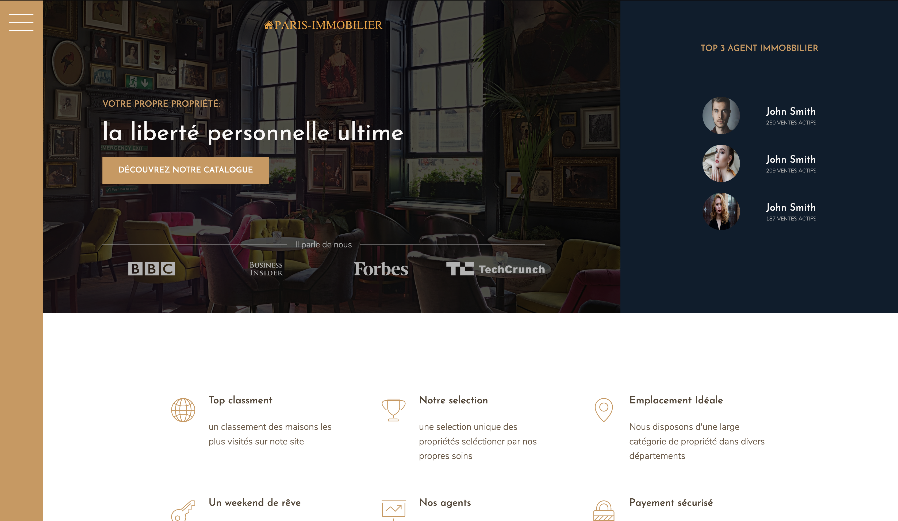

[](https://snyk.io/test/github/batouche-dev/advanced-css?targetFile=package.json)
[](https://www.codacy.com/manual/batouche-dev/css-grid?utm_source=github.com&amp;utm_medium=referral&amp;utm_content=batouche-dev/css-grid&amp;utm_campaign=Badge_Grade)
[](https://github.com/prettier/prettier)


# Description

This project using html, saas, node (css grid, BEM, 7-1, etc.. ) to get a website designed.

# ScreenShot



# Demo

To get the demo click of the website click here : [Paris-Immobilier](https://azedine-batouche.github.io/css-grid/#) .

# Setup

first clone the project in your workspace with this command line

```
git clone https://github.com/batouche-dev/css-grid.git
```

# Launch

```
cd css-grid
```

and then open index.html file with any browser: chrome, firefox, safari ...
